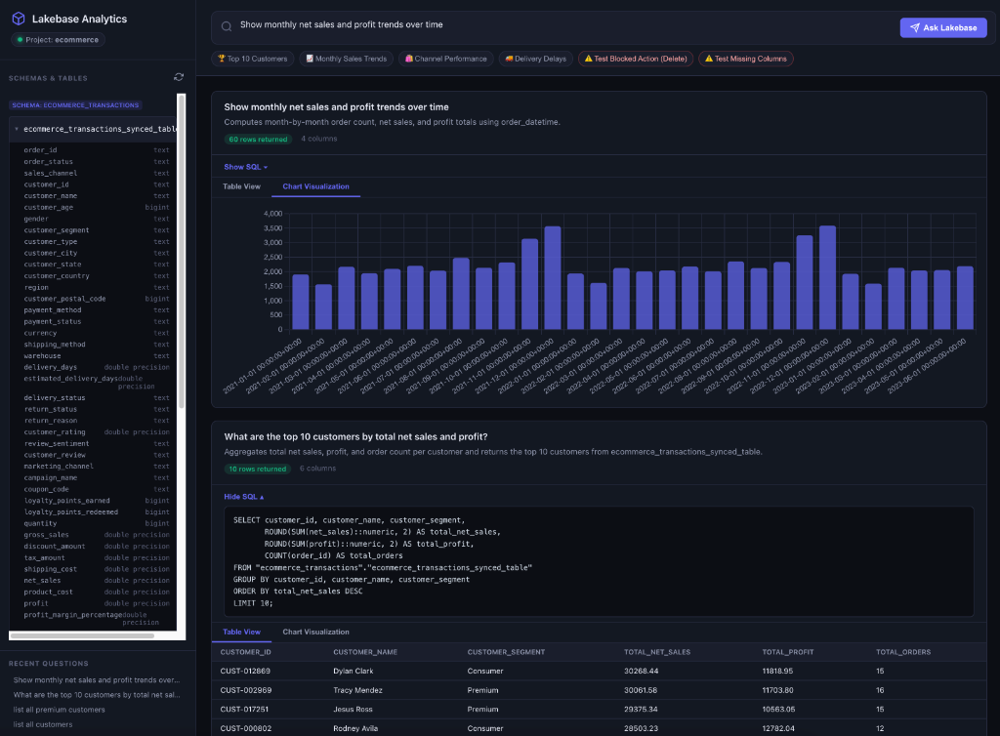

# Lakebase Natural Language Analytics



A web application that lets you query a [Databricks Lakebase](https://docs.databricks.com/en/lakebase/index.html) PostgreSQL database using plain English. Questions are translated into SQL, executed against Lakebase, and rendered as interactive tables and charts. Queries that cannot be fulfilled—write operations, missing data, ambiguous intent—are rejected with a clear rationale.

## How It Works

```
User question → LLM (Gemini 2.5 Flash) → PostgreSQL SQL → Lakebase → Results (table + chart)
                                        ↘ or UNEXECUTABLE → Rationale card with explanation
```

1. You type a question (e.g. *"Top 10 customers by revenue"*).
2. The backend sends the question and the live database schema to the LLM.
3. The LLM returns either executable SQL or an explanation of why the request can't be fulfilled.
4. Executable queries run against Lakebase via the PostgreSQL wire protocol and results render in the browser.

## Architecture

```
databricks-nl-analytics/
├── main.py                  # FastAPI entrypoint, mounts API + static files
├── app/
│   ├── config.py            # Loads settings from .env (project, host, schemas)
│   ├── db.py                # LakebaseClient — psycopg2 connection, schema introspection,
│   │                        #   query execution, auto-token refresh via Databricks CLI
│   ├── llm.py               # LLMClient — Gemini NL→SQL with unexecutable detection,
│   │                        #   heuristic fallback when no API key is set
│   ├── models.py            # Pydantic models (QueryRequest/Response, UnexecutableQueryResponse)
│   └── routes.py            # /api/schema (GET) and /api/query (POST) endpoints
├── static/
│   ├── index.html           # Single-page UI with sidebar, query bar, quick-action chips
│   ├── style.css            # Dark theme styling
│   └── app.js               # Frontend logic — schema tree, result/error cards, Chart.js
├── .env                     # Runtime configuration (project, host, credentials)
└── requirements.txt         # Python dependencies
```

### Key Components

| Component | Role |
|---|---|
| **`db.py` — LakebaseClient** | Connects to Lakebase over PostgreSQL (psycopg2). Automatically generates OAuth tokens via the Databricks CLI and retries on token expiry. Introspects `information_schema` to discover tables and columns across multiple schemas. |
| **`llm.py` — LLMClient** | Sends the database schema + user question to Gemini 2.5 Flash. The system prompt instructs the model to return `EXECUTABLE` (with SQL) or `UNEXECUTABLE` (with error type, rationale, and suggested alternative). A heuristic fallback provides canned queries when no Gemini API key is configured. |
| **`routes.py` — API** | `GET /api/schema` returns the introspected schema. `POST /api/query` translates the question, executes it, and returns results (HTTP 200) or an unexecutable rationale (HTTP 422). |
| **`static/` — Frontend** | Vanilla HTML/CSS/JS. Renders a schema sidebar, query bar with preset chips, result cards with table/chart toggle (Chart.js), and styled error cards for unexecutable queries showing rationale and clickable alternatives. |

### Unexecutable Query Handling

Not all requests can be turned into valid SQL. The system classifies these into:

| Error Type | Example | Behavior |
|---|---|---|
| `WRITE_ATTEMPT` | *"Delete all returned orders"* | Blocked — explains that only SELECT queries are allowed |
| `MISSING_COLUMNS` | *"What is the average employee salary?"* | Blocked — explains what data exists vs. what was requested |
| `AMBIGUOUS_REQUEST` | Vague or context-free prompts | Blocked — suggests a concrete alternative question |
| `DATABASE_EXECUTION_ERROR` | Valid-looking SQL that PostgreSQL rejects | Shows the SQL and the engine error message |

## Setup

### Prerequisites

- Python 3.9+
- [Databricks CLI](https://docs.databricks.com/en/dev-tools/cli/index.html) installed and authenticated (used for automatic OAuth token generation)

### Install & Run

```bash
# Install dependencies
python3 -m venv .venv
source .venv/bin/activate
pip install -r requirements.txt

# Configure (edit .env with your Lakebase project details)
cp .env.example .env

# Start the server
uvicorn main:app --port 8000
```

Open [http://localhost:8000](http://localhost:8000).

### Configuration (`.env`)

| Variable | Description | Default |
|---|---|---|
| `LAKEBASE_PROJECT` | Lakebase project ID | `ecommerce` |
| `LAKEBASE_BRANCH` | Branch name | `production` |
| `LAKEBASE_ENDPOINT` | Endpoint name | `primary` |
| `LAKEBASE_HOST` | PostgreSQL hostname | *(from endpoint)* |
| `LAKEBASE_DATABASE` | Database name | `databricks_postgres` |
| `LAKEBASE_ROLE` | PostgreSQL role (user email or service principal ID) | *(SP client ID)* |
| `LAKEBASE_SCHEMAS` | Comma-separated schemas to introspect | `ecommerce_transactions,public` |
| `LAKEBASE_TOKEN` | OAuth token (leave blank for auto-refresh via CLI) | *(blank)* |
| `GEMINI_API_KEY` | Google Gemini API key (optional — heuristic fallback active without it) | *(blank)* |

### OAuth Token Management

The app automatically generates short-lived OAuth tokens by calling `databricks postgres generate-database-credential` via the CLI. If a token expires mid-session, the connection retries with a fresh one. No manual token management is needed as long as the Databricks CLI is authenticated.
